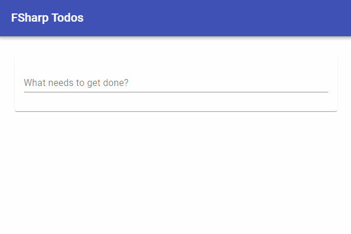

# FSharpTodos
Todo application implemented with various F# libraries.

## FelizClientOnly
Client-side only todo written with Feliz and Material UI

- Fable: [https://fable.io/](https://fable.io/)
- Feliz: [https://zaid-ajaj.github.io/Feliz/](https://zaid-ajaj.github.io/Feliz/)
- Feliz.MaterialUI: [https://cmeeren.github.io/Feliz.MaterialUI](https://cmeeren.github.io/Feliz.MaterialUI)

## FelizGiraffeRemoting
Server/Client todo written with Feliz for the client, Giraffe for the server, and Fable Remoting for communication.

- SAFE Stack [https://safe-stack.github.io/](https://safe-stack.github.io/)
- Fable: [https://fable.io/](https://fable.io/)
- Feliz: [https://zaid-ajaj.github.io/Feliz/](https://zaid-ajaj.github.io/Feliz/)
- Feliz.MaterialUI: [https://cmeeren.github.io/Feliz.MaterialUI](https://cmeeren.github.io/Feliz.MaterialUI)
- Giraffe: [https://github.com/giraffe-fsharp/Giraffe](https://github.com/giraffe-fsharp/Giraffe)
- Fable.Remoting: [https://zaid-ajaj.github.io/Fable.Remoting/](https://zaid-ajaj.github.io/Fable.Remoting/)